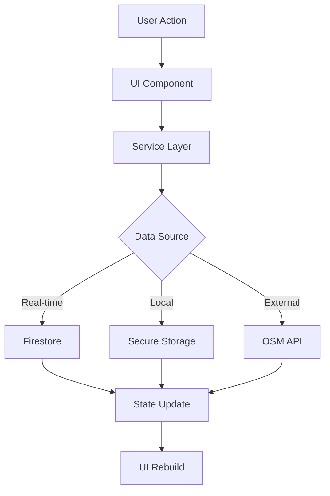

# Putrace - Privacy-First Professional Networking

<div align="center">


**Revolutionary professional networking that puts privacy first**

[Features](#-features) • [Quick Start](#-quick-start) • [Architecture](#-architecture) • [Development](#-development) • [Contributing](#-contributing)

</div>

---

## 📖 Table of Contents

- [🎯 What is Putrace?](#-what-is-putrace)
- [✨ Features](#-features)
- [🚀 Quick Start](#-quick-start)
- [🏗️ Architecture](#️-architecture)
- [📱 Current Implementation Status](#-current-implementation-status)
- [🛠️ Development Setup](#️-development-setup)
- [📊 Project Structure](#-project-structure)
- [🔧 Configuration](#-configuration)
- [🐛 Troubleshooting](#-troubleshooting)
- [📈 Roadmap](#-roadmap)
- [🤝 Contributing](#-contributing)
- [📄 License](#-license)

---

## 🎯 What is Putrace?

Putrace is a **privacy-first professional networking application** that enables spontaneous, meaningful connections between professionals without compromising personal data or requiring phone numbers.

### 🌟 Core Philosophy

- **Privacy-First**: No phone numbers required, end-to-end encryption, minimal data collection
- **Context-Aware**: Discover professionals based on location, events, and shared interests
- **Professional Focus**: Designed specifically for meaningful business relationships
- **Offline Capable**: BLE-based discovery works without internet connectivity

### 🎪 The Problem We Solve

Traditional networking apps require extensive personal information, have poor discovery mechanisms, and often compromise user privacy. Putrace addresses these issues by:

- **Instant Discovery**: Find nearby professionals in real-time using BLE and GPS
- **Venue-Based Networking**: Set availability at specific locations (cafes, co-working spaces, events)
- **Global Virtual Mode**: Connect with professionals worldwide through virtual networking
- **Privacy Protection**: No personal data harvesting, encrypted communications

---

## ✨ Features

### 🎯 Three-Mode Availability System

#### 1. 📍 **Nearby Mode** (BLE Proximity)
- **Real-time discovery** within 50 meters using Bluetooth Low Energy
- **Instant connections** for immediate networking opportunities
- **Offline capable** - works without internet connectivity
- **Animated pulse visualization** showing nearby professionals
- **Privacy controls** for discovery radius and visibility

#### 2. 🗺️ **Location Mode** (Venue-Based)
- **OSM-powered venue discovery** using OpenStreetMap data
- **Auto-discovery** of venues as you pan the map
- **Custom venue pinning** and "My Places" functionality
- **Scheduled availability** with date/time selection
- **Custom messages** for each venue (e.g., "Meet me for coffee")
- **Venue-specific settings** (range, timer, precision)

#### 3. 🌐 **Virtual Mode** (Global Networking)
- **Worldwide professional discovery** without location constraints
- **Real-time chat rooms** for global networking
- **Timezone-aware availability** for international connections
- **Virtual meeting coordination** with calendar integration

### 🔒 Privacy & Security Features

- **End-to-end encryption** for all communications
- **No phone number requirement** for authentication
- **Granular privacy controls** (connection degree, industry, meeting type)
- **Temporary visibility controls** for specific individuals
- **Location data minimization** with automatic expiration
- **Secure key management** using Flutter Secure Storage

### 🎨 User Experience

- **Intuitive three-mode interface** with clear visual indicators
- **Haptic feedback** for all interactions
- **Real-time status updates** and availability management
- **Customizable profiles** with professional context
- **Smart notifications** for relevant networking opportunities

---

## 🚀 Quick Start

### Prerequisites

- **Flutter SDK** (3.0.0 or higher)
- **Dart SDK** (3.0.0 or higher)
- **Android Studio** or **VS Code** with Flutter extensions
- **Firebase project** with Firestore enabled
- **Android device** or emulator with BLE support

### Installation

1. **Clone the repository**
   ```bash
   git clone https://github.com/yourusername/putrace.git
   cd putrace
   ```

2. **Install dependencies**
   ```bash
   flutter pub get
   ```

3. **Configure Firebase**
   - Create a Firebase project at [console.firebase.google.com](https://console.firebase.google.com)
   - Enable Firestore and Authentication
   - Download `google-services.json` and place in `android/app/`
   - Download `GoogleService-Info.plist` and place in `ios/Runner/`

4. **Run the app**
   ```bash
   flutter run
   ```

### First-Time Setup

1. **Grant permissions** when prompted:
   - Location access (for venue discovery)
   - Bluetooth access (for nearby mode)
   - Camera access (for profile photos)

2. **Create your profile** with professional information

3. **Choose your availability mode**:
   - **Nearby**: For immediate, local networking
   - **Location**: For venue-based networking
   - **Virtual**: For global professional connections

---

## 🏗️ Architecture

### 🎯 High-Level Architecture

```
┌─────────────────────────────────────────────────────────────┐
│                    Putrace Flutter App                    │
├─────────────────────────────────────────────────────────────┤
│  Presentation Layer                                        │
│  ├── Pages (Home, Location, Virtual, Settings)            │
│  ├── Widgets (Cards, Buttons, Animations)                 │
│  └── Navigation (GoRouter)                                 │
├─────────────────────────────────────────────────────────────┤
│  Business Logic Layer                                      │
│  ├── Services (BLE, Discovery, Venue, User)               │
│  ├── Models (User, Venue, Availability)                   │
│  └── State Management (GetIt, Streams)                    │
├─────────────────────────────────────────────────────────────┤
│  Data Layer                                                │
│  ├── Firebase (Firestore, Auth, Storage)                  │
│  ├── Local Storage (Secure Storage, Shared Preferences)   │
│  └── External APIs (OpenStreetMap, Geocoding)             │
├─────────────────────────────────────────────────────────────┤
│  Platform Layer                                            │
│  ├── BLE Scanning (flutter_blue_plus)                     │
│  ├── Location Services (geolocator)                       │
│  └── Maps (flutter_map, OpenStreetMap)                    │
└─────────────────────────────────────────────────────────────┘
```

### 🔧 Technology Stack

| Component | Technology | Purpose |
|-----------|------------|---------|
| **Frontend** | Flutter 3.0+ | Cross-platform mobile development |
| **Backend** | Firebase | Authentication, database, storage |
| **Database** | Firestore | Real-time data synchronization |
| **Maps** | OpenStreetMap | Free, privacy-focused mapping |
| **BLE** | flutter_blue_plus | Bluetooth Low Energy scanning |
| **Location** | geolocator | GPS and location services |
| **State** | GetIt | Dependency injection |
| **Navigation** | GoRouter | Declarative routing |
| **Storage** | Flutter Secure Storage | Encrypted local storage |

### 📊 Data Flow



---

## 📱 Current Implementation Status

### ✅ **Completed Features**

#### Core Infrastructure
- [x] **Flutter app structure** with proper architecture
- [x] **Firebase integration** (Auth, Firestore, Storage)
- [x] **Dependency injection** with GetIt
- [x] **Navigation system** with GoRouter
- [x] **State management** with streams and providers

#### Location Mode (OSM-Based)
- [x] **OpenStreetMap integration** with flutter_map
- [x] **Auto-venue discovery** using Overpass API
- [x] **Venue pinning and "My Places"** functionality
- [x] **Custom message input** for each venue
- [x] **Scheduled availability** with date/time picker
- [x] **Venue-specific settings** (range, timer, precision)
- [x] **Search functionality** in venue list
- [x] **Real-time venue filtering** and discovery

#### User Interface
- [x] **Three-mode availability system** (Nearby, Location, Virtual)
- [x] **Professional Presence Hub** main screen
- [x] **Animated pulse visualization** for nearby mode
- [x] **Haptic feedback** for all interactions
- [x] **Form validation** with visual highlighting
- [x] **Responsive design** for different screen sizes

#### Privacy & Security
- [x] **End-to-end encryption** setup
- [x] **Secure storage** for sensitive data
- [x] **Privacy controls** for discovery settings
- [x] **Data minimization** principles

### 🔄 **In Progress**

#### BLE Discovery System
- [ ] **Real BLE scanning** implementation
- [ ] **Firestore index creation** for geohash queries
- [ ] **Distance calculation** and proximity detection
- [ ] **Offline discovery** capabilities

#### Virtual Mode
- [ ] **Global professional discovery** interface
- [ ] **Real-time chat rooms** implementation
- [ ] **Timezone-aware availability** system
- [ ] **Virtual meeting coordination**

### ❌ **Planned Features**

#### Advanced Networking
- [ ] **Meeting request system** with approval workflow
- [ ] **Profile compatibility scoring** based on shared interests
- [ ] **Calendar integration** for meeting scheduling
- [ ] **Video verification** for new connections

#### Analytics & Insights
- [ ] **Meeting success analytics** and reporting
- [ ] **Optimal timing suggestions** based on historical data
- [ ] **Connection value scoring** and recommendations
- [ ] **Usage statistics** and insights dashboard

#### Enterprise Features
- [ ] **Team availability** at conferences and events
- [ ] **Event organizer tools** for networking facilitation
- [ ] **Business development** tracking and analytics
- [ ] **Corporate account** management

---

## 🛠️ Development Setup

### Environment Requirements

```bash
# Flutter SDK
flutter --version  # Should be 3.0.0+

# Dart SDK
dart --version     # Should be 3.0.0+

# Android SDK
flutter doctor     # Check Android toolchain

# iOS (optional)
flutter doctor     # Check iOS toolchain
```

### Project Dependencies

```yaml
# Core Flutter
flutter: ^3.0.0

# Firebase
firebase_core: ^2.24.2
firebase_auth: ^4.15.3
cloud_firestore: ^4.13.6
firebase_storage: ^11.5.6

# Maps & Location
flutter_map: ^8.2.1
latlong2: ^0.9.1
geolocator: ^10.1.0

# BLE & Connectivity
flutter_blue_plus: ^1.12.14
dart_geohash: ^2.1.0

# UI & Navigation
go_router: ^12.1.3
get_it: ^7.6.4
google_fonts: ^6.1.0

# Storage & Security
flutter_secure_storage: ^9.0.0
shared_preferences: ^2.2.2

# HTTP & APIs
http: ^1.1.2
```

### Development Commands

```bash
# Install dependencies
flutter pub get

# Run on Android
flutter run -d android

# Run on iOS
flutter run -d ios

# Run tests
flutter test

# Build APK
flutter build apk --release

# Build iOS
flutter build ios --release
```

---

## 📊 Project Structure

```
lib/
├── main.dart                          # App entry point
├── core/                              # Core utilities
│   ├── constants/                     # App constants
│   ├── services/                      # Core services
│   └── utils/                         # Utility functions
├── features/                          # Feature modules
│   └── putrace/                      # Main Putrace feature
│       ├── data/                      # Data layer
│       │   ├── models/                # Data models
│       │   ├── services/              # Data services
│       │   └── repositories/          # Data repositories
│       ├── domain/                    # Business logic
│       │   ├── entities/              # Domain entities
│       │   ├── repositories/          # Repository interfaces
│       │   └── usecases/              # Business use cases
│       └── presentation/              # UI layer
│           ├── pages/                 # Screen pages
│           ├── widgets/               # Reusable widgets
│           └── providers/             # State providers
├── shared/                            # Shared components
│   ├── widgets/                       # Shared widgets
│   ├── services/                      # Shared services
│   └── utils/                         # Shared utilities
└── docs/                              # Documentation
    ├── readme.md                      # User stories
    ├── architecture.md                # Technical architecture
    └── api/                           # API documentation
```

### Key Files Explained

| File | Purpose |
|------|---------|
| `main.dart` | App initialization, Firebase setup, dependency injection |
| `putrace_home_page.dart` | Main screen with three-mode availability system |
| `simple_osm_page.dart` | Location mode with OSM venue discovery |
| `ble_discovery_service.dart` | BLE scanning and advertising |
| `user_discovery_service.dart` | Firestore-based user discovery |
| `osm_venue_service.dart` | OpenStreetMap venue discovery |
| `venue_persistence_service.dart` | Venue data persistence |

---

## 🔧 Configuration

### Firebase Setup

1. **Create Firebase Project**
   ```bash
   # Install Firebase CLI
   npm install -g firebase-tools
   
   # Login to Firebase
   firebase login
   
   # Initialize project
   firebase init
   ```

2. **Enable Services**
   - Authentication (Email/Password)
   - Firestore Database
   - Storage
   - Analytics (optional)

3. **Configure Security Rules**
   ```javascript
   // firestore.rules
   rules_version = '2';
   service cloud.firestore {
     match /databases/{database}/documents {
       match /{document=**} {
         allow read, write: if request.auth != null;
       }
     }
   }
   ```

### Environment Variables

Create `.env` file in project root:
```env
# Firebase Configuration
FIREBASE_API_KEY=your_api_key
FIREBASE_PROJECT_ID=your_project_id
FIREBASE_MESSAGING_SENDER_ID=your_sender_id
FIREBASE_APP_ID=your_app_id

# OpenStreetMap Configuration
OSM_OVERPass_API_URL=https://overpass-api.de/api/interpreter
OSM_TIMEOUT_SECONDS=25
```

### Platform-Specific Configuration

#### Android (`android/app/src/main/AndroidManifest.xml`)
```xml
<uses-permission android:name="android.permission.ACCESS_FINE_LOCATION" />
<uses-permission android:name="android.permission.ACCESS_COARSE_LOCATION" />
<uses-permission android:name="android.permission.BLUETOOTH" />
<uses-permission android:name="android.permission.BLUETOOTH_ADMIN" />
<uses-permission android:name="android.permission.BLUETOOTH_CONNECT" />
<uses-permission android:name="android.permission.BLUETOOTH_SCAN" />
```

#### iOS (`ios/Runner/Info.plist`)
```xml
<key>NSLocationWhenInUseUsageDescription</key>
<string>Putrace needs location access to discover nearby professionals and venues</string>
<key>NSBluetoothAlwaysUsageDescription</key>
<string>Putrace uses Bluetooth to discover nearby professionals in offline mode</string>
```

---

## 🐛 Troubleshooting

### Common Issues

#### 1. **Firestore Index Errors**
```
Error: The query requires an index
```
**Solution**: Create the required composite index in Firebase Console
```bash
# The index URL is provided in the error message
# Click the link to auto-create the index
```

#### 2. **BLE Permission Issues**
```
Error: Bluetooth permission denied
```
**Solution**: 
- Check device Bluetooth is enabled
- Grant app permissions in device settings
- Test on physical device (BLE doesn't work in emulator)

#### 3. **Location Permission Issues**
```
Error: Location permission denied
```
**Solution**:
- Check device location services are enabled
- Grant location permissions in app settings
- Test on physical device for accurate GPS

#### 4. **OSM API Timeout**
```
Error: Overpass API timeout
```
**Solution**:
- Check internet connectivity
- Reduce query complexity
- Increase timeout in `osm_venue_service.dart`

#### 5. **Build Issues**
```
Error: Gradle build failed
```
**Solution**:
```bash
# Clean and rebuild
flutter clean
flutter pub get
cd android && ./gradlew clean && cd ..
flutter run
```

### Debug Mode

Enable debug logging:
```dart
// In main.dart
import 'package:flutter/foundation.dart';

void main() {
  if (kDebugMode) {
    // Enable debug logging
    debugPrint('Debug mode enabled');
  }
  runApp(MyApp());
}
```

### Performance Optimization

1. **Reduce BLE scanning frequency** for battery life
2. **Implement venue caching** to reduce API calls
3. **Use pagination** for large venue lists
4. **Optimize map rendering** with marker clustering

---

## 📈 Roadmap

### Phase 1: Core Foundation (Current)
- [x] Basic three-mode availability system
- [x] OSM venue discovery and management
- [x] User interface and navigation
- [x] Privacy and security framework

### Phase 2: Real Networking (Next 2-4 weeks)
- [ ] Complete BLE discovery implementation
- [ ] Firestore index optimization
- [ ] Real-time user discovery and matching
- [ ] Basic meeting request system

### Phase 3: Advanced Features (1-2 months)
- [ ] Virtual mode with global networking
- [ ] Advanced profile compatibility
- [ ] Calendar integration
- [ ] Analytics and insights

### Phase 4: Enterprise & Scale (2-3 months)
- [ ] Team and event management
- [ ] Advanced analytics dashboard
- [ ] API for third-party integrations
- [ ] Multi-platform support (iOS, Web)

### Phase 5: AI & Intelligence (3-6 months)
- [ ] AI-powered matching algorithms
- [ ] Predictive networking suggestions
- [ ] Smart scheduling optimization
- [ ] Advanced privacy controls

---

## 🤝 Contributing

We welcome contributions! Please see our [Contributing Guidelines](CONTRIBUTING.md) for details.

### Development Workflow

1. **Fork the repository**
2. **Create a feature branch**
   ```bash
   git checkout -b feature/amazing-feature
   ```
3. **Make your changes**
4. **Add tests** for new functionality
5. **Commit your changes**
   ```bash
   git commit -m "Add amazing feature"
   ```
6. **Push to your branch**
   ```bash
   git push origin feature/amazing-feature
   ```
7. **Open a Pull Request**

### Code Style

- Follow [Dart Style Guide](https://dart.dev/guides/language/effective-dart/style)
- Use meaningful variable and function names
- Add comments for complex logic
- Write tests for new features
- Update documentation as needed

### Reporting Issues

When reporting issues, please include:
- **Device information** (OS version, device model)
- **App version** and build number
- **Steps to reproduce** the issue
- **Expected vs actual behavior**
- **Screenshots or logs** if applicable

---

## 📄 License

This project is licensed under the MIT License - see the [LICENSE](LICENSE) file for details.

---

## 🙏 Acknowledgments

- **OpenStreetMap** for providing free, open-source mapping data
- **Flutter team** for the amazing cross-platform framework
- **Firebase** for the comprehensive backend services
- **Community contributors** who help improve Putrace

---

<div align="center">

**Made with ❤️ for the professional networking community**

[Website](https://putrace.app) • [Documentation](https://docs.putrace.app) • [Support](https://support.putrace.app) • [Discord](https://discord.gg/putrace)

</div>