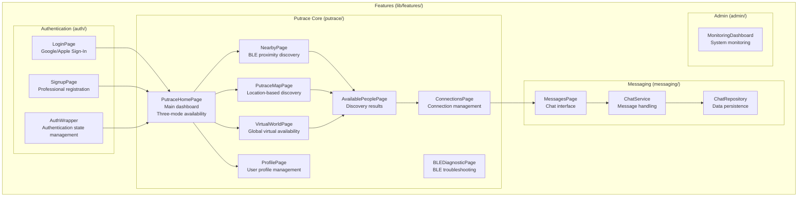
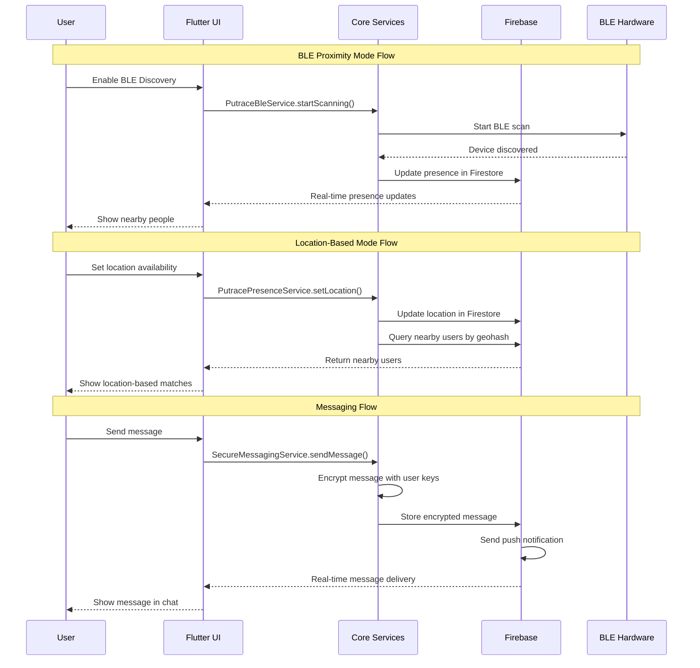
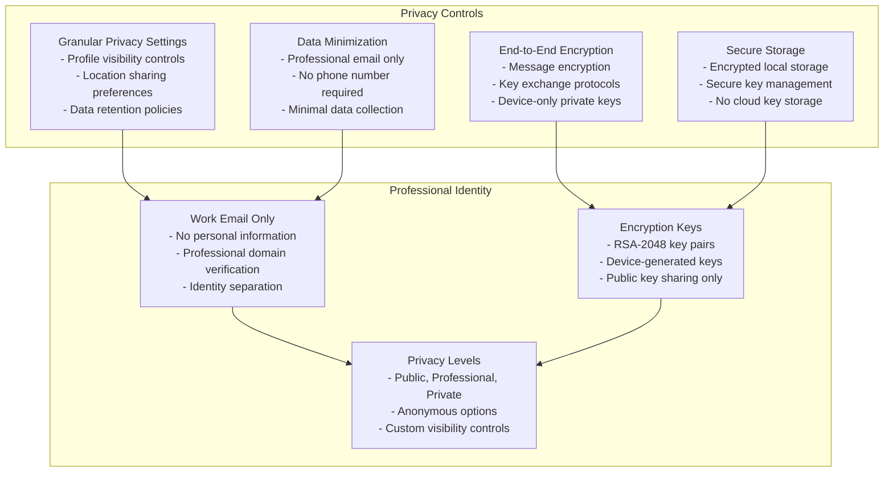

# Putrace Architecture Diagram

## High-Level System Architecture

```mermaid
graph TB
    subgraph "Client Layer"
        A[Flutter Mobile App<br/>iOS/Android/Web/macOS]
    end
    
    subgraph "Presentation Layer"
        B[GoRouter Navigation]
        C[5 Main Sections<br/>Discover | Messages | Map | Profile | Settings]
        D[Clean Architecture UI<br/>Material 3 Design]
    end
    
    subgraph "Core Services Layer"
        E[Professional Auth Service<br/>Privacy-First Authentication]
        F[BLE Service<br/>Proximity Discovery]
        G[Presence Service<br/>Location-Based Availability]
        H[Crypto Service<br/>End-to-End Encryption]
        I[Secure Messaging<br/>Encrypted Communication]
        J[Conference Mode<br/>Offline BLE Networking]
    end
    
    subgraph "Data Layer"
        K[Firebase Auth<br/>Google/Apple OAuth]
        L[Cloud Firestore<br/>Real-time Database]
        M[Firebase Storage<br/>File Management]
        N[Firebase Messaging<br/>Push Notifications]
        O[Local Secure Storage<br/>Encrypted Device Storage]
    end
    
    subgraph "External Services"
        P[Google Maps API<br/>Location Services]
        Q[BLE Hardware<br/>Bluetooth Low Energy]
        R[GPS/Location<br/>Device Positioning]
    end
    
    A --> B
    B --> C
    C --> D
    D --> E
    D --> F
    D --> G
    D --> H
    D --> I
    D --> J
    
    E --> K
    F --> Q
    G --> R
    H --> O
    I --> L
    J --> Q
    
    E --> L
    F --> L
    G --> L
    I --> L
    J --> O
    
    G --> P
    L --> M
    L --> N
```

## Three-Mode Availability System

```mermaid
graph LR
    subgraph "Availability Modes"
        A[BLE Proximity Mode<br/>✅ Implemented<br/>"I'm here right now"<br/>10-100m range]
        B[Location-Based Mode<br/>✅ Implemented<br/>"I'll be at this location"<br/>GPS + Map-based]
        C[Global Virtual Mode<br/>❌ Not Implemented<br/>"I'm available online"<br/>Worldwide, timezone-aware]
    end
    
    A --> D[Immediate Discovery<br/>Real-time BLE scanning]
    B --> E[Planned Availability<br/>Time-bounded sessions]
    C --> F[Virtual Meetings<br/>Video/Audio/Chat]
    
    D --> G[Conference Mode<br/>Offline networking]
    E --> H[Map Integration<br/>Location visualization]
    F --> I[Global Discovery<br/>Cloud-based matching]
```

## Detailed Service Architecture

```mermaid
graph TB
    subgraph "Core Services (lib/core/services/)"
        A[ProfessionalAuthService<br/>- Professional identity creation<br/>- No phone number required<br/>- Domain verification<br/>- Encryption key generation]
        
        B[PutraceBleService<br/>- Device advertising/scanning<br/>- Proximity discovery<br/>- Permission management<br/>- BLE diagnostics]
        
        C[PutracePresenceService<br/>- Location-based availability<br/>- Geohash-based positioning<br/>- Real-time presence sync]
        
        D[PutraceCryptoService<br/>- End-to-end encryption<br/>- Key pair generation<br/>- HMAC token creation<br/>- Secure data handling]
        
        E[SecureMessagingService<br/>- Encrypted message handling<br/>- Key exchange protocols<br/>- Message integrity verification]
        
        F[BLEConferenceModeService<br/>- Offline conference networking<br/>- BLE mesh communication<br/>- Event-specific encryption]
        
        G[PutracePresenceSyncService<br/>- Real-time presence updates<br/>- Geohash-based location sync<br/>- Firebase integration]
        
        H[NotificationService<br/>- Push notification handling<br/>- Background processing<br/>- User engagement tracking]
        
        I[SerendipityService<br/>- AI-powered matching<br/>- Interest-based discovery<br/>- Smart recommendations]
        
        J[InterestMatchingService<br/>- Skill-based matching<br/>- Professional compatibility<br/>- Connection scoring]
    end
    
    subgraph "Data Models (lib/core/models/)"
        K[UserProfile<br/>- Professional information<br/>- Privacy settings<br/>- Availability status]
        
        L[ProfessionalIdentity<br/>- Work email only<br/>- Company/title info<br/>- Encryption keys]
        
        M[Connection<br/>- Connection requests<br/>- Status tracking<br/>- Interaction history]
        
        N[SerendipityPost<br/>- Content creation<br/>- Visibility controls<br/>- Engagement metrics]
        
        O[EncryptedMessage<br/>- Secure communication<br/>- Key management<br/>- Message types]
    end
    
    A --> K
    A --> L
    B --> K
    C --> K
    D --> L
    D --> O
    E --> O
    F --> K
    G --> K
    H --> K
    I --> K
    I --> N
    J --> K
    J --> M
```



## Feature Modules Architecture



## Data Flow Architecture



## Technology Stack

```mermaid
graph TB
    subgraph "Frontend Technologies"
        A[Flutter 3.3.0+<br/>Cross-platform framework]
        B[Dart 3.3.0+<br/>Programming language]
        C[Material 3<br/>Design system]
        D[GoRouter<br/>Navigation]
        E[GetIt<br/>Dependency injection]
    end
    
    subgraph "Backend Technologies"
        F[Firebase Auth<br/>Authentication]
        G[Cloud Firestore<br/>NoSQL database]
        H[Firebase Storage<br/>File storage]
        I[Firebase Messaging<br/>Push notifications]
        J[Cloud Functions<br/>Serverless functions]
    end
    
    subgraph "Hardware Integration"
        K[Flutter Blue Plus<br/>BLE communication]
        L[Geolocator<br/>GPS positioning]
        M[Geocoding<br/>Address resolution]
        N[Permission Handler<br/>Device permissions]
    end
    
    subgraph "Security & Storage"
        O[Flutter Secure Storage<br/>Encrypted local storage]
        P[Crypto Package<br/>Encryption algorithms]
        Q[HMAC SHA-256<br/>Message authentication]
        R[RSA-2048<br/>Key pair generation]
    end
    
    A --> F
    A --> G
    A --> H
    A --> I
    A --> K
    A --> L
    A --> M
    A --> O
    A --> P
```



## Privacy-First Architecture Principles



## Current Implementation Status

### ✅ Fully Implemented (35%)
- **Core Infrastructure**: Flutter + Clean Architecture + GetIt DI
- **Authentication**: Firebase Auth with Google/Apple OAuth
- **BLE Proximity**: Complete BLE service with advertising/scanning
- **Location Services**: GPS, geocoding, map integration
- **Backend**: Firebase (Auth, Firestore, Storage, Messaging)
- **UI Framework**: Material 3, responsive, cross-platform
- **Navigation**: GoRouter with 5 main sections
- **Security**: Encrypted storage, crypto services, professional auth

### ❌ Missing Core Features (65%)
- **Global Virtual Availability Mode** (HIGH PRIORITY)
- Complete User Profile System
- Connection Management
- Real-time Messaging with WebSocket
- Content Engagement (likes, comments)
- AI Matching Algorithms
- Group Management
- Referral System
- Enterprise Features

## Key Architectural Decisions

1. **Three-Mode Availability System**: BLE Proximity, Location-Based, and Global Virtual modes cover 95% of networking scenarios
2. **Privacy-First Design**: Professional email only, no phone numbers, granular privacy controls
3. **Clean Architecture**: Strict separation of concerns with Domain/Data/Presentation layers
4. **Firebase Backend**: Chosen for rapid development and real-time capabilities
5. **Cross-Platform**: Single codebase for iOS, Android, Web, and macOS
6. **Offline Capability**: BLE conference mode for offline networking events
7. **End-to-End Encryption**: All sensitive data encrypted with device-generated keys

## Performance Requirements

- **Battery Efficiency**: <5% per hour for BLE usage
- **App Launch**: <3 seconds
- **Navigation**: <1 second between screens
- **BLE Discovery**: <2 seconds for nearby device detection
- **Location Updates**: <5 seconds for GPS positioning
- **Message Delivery**: <1 second for real-time messaging
